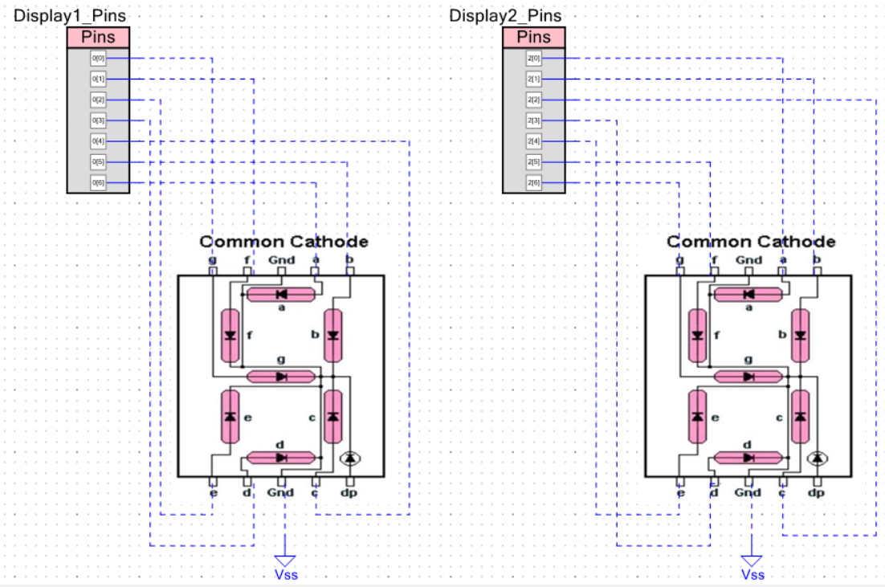

# 05 - Librería para Display Dual de 7 Segmentos

Este proyecto contiene una librería en C (`DDisplay`) desarrollada desde cero para controlar dos displays de 7 segmentos en un microcontrolador PSoC. El objetivo es crear un driver modular, reutilizable y fácil de usar que encapsule la complejidad del hardware.

La librería convierte un número de 8 bits en su representación de dos dígitos, ya sea en formato decimal o hexadecimal, y también permite mostrar secuencias de patrones personalizados por el usuario.

## Características principales
- **Control Dual Unificado:** Maneja dos displays de 7 segmentos como una sola unidad a través de una interfaz de 16 bits.
- **Modo Decimal:** Capaz de mostrar cualquier número entre 0 y 99.
- **Modo Hexadecimal:** Capaz de mostrar cualquier valor, desde `00` hasta `FF` (0-255).
- **Modo de Patrones:** Permite mostrar secuencias de "dibujos" o símbolos personalizados de 16 bits definidos por el usuario.
- **Funciones de Navegación:** Incluye funciones como `IncrementValue()`, `DecrementValue()`, `NextPattern()` y `PreviousPattern()` para una fácil interacción sin necesidad de manejar contadores en el programa principal.
- **Configurable:** Soporta tanto displays de **ánodo común** como de **cátodo común** a través de una sola macro (`DDISPLAY_CONFIG`) en el archivo `.h`.

## Conexión física

En este ejemplo, trabajamos con dos displays de siete segmentos de cátodo común. Lo que quiere decir que requiere un 1 (o 5 volts) para prender. A diferencia de un ánodo común donde necesita un 0 (o 0 volts) para prender. Sigue el siguiente diagrama de conexión. El diagrama no cambia mucho con un ánodo común, simplemente en vez de conectar tierra (VSS) conectarás voltaje (VCC).

**DIAGRAMA DEL CIRCUITO:**

## Configuración de Pines
Crea dos pines de salida digitales de 7 pines cada uno. Recuerda colocarles strong drive (switch de 0 a 5V), posterior a esto, dependiendo de si tu display es Cátodo Común o Ánodo Común, deberás elegir su estado inicial como 0 o 1 respectivamente.

**CAPTURA DE LA CONFIGURACIÓN DE PINES:**

