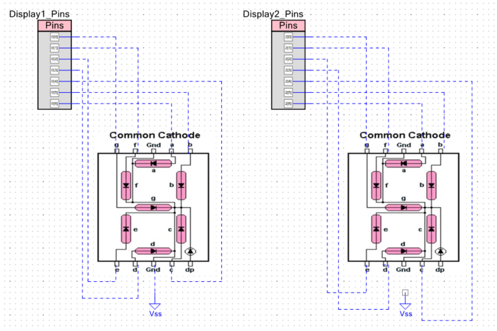
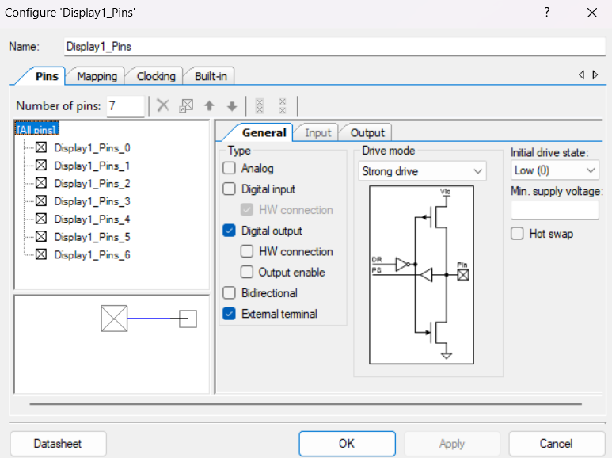
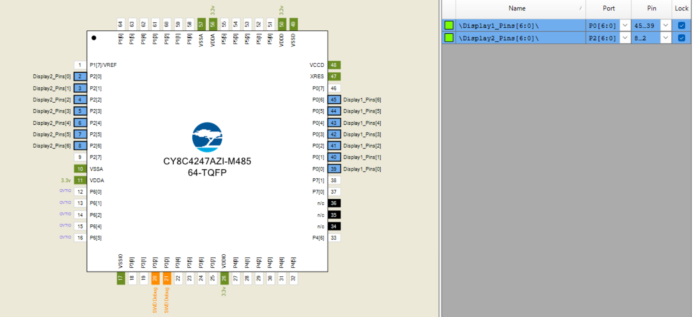

# 05 - Librería para Display Dual de 7 Segmentos

Este proyecto contiene una librería en C (`DDisplay`) desarrollada desde cero para controlar dos displays de 7 segmentos en un microcontrolador PSoC. El objetivo es crear un driver modular, reutilizable y fácil de usar que encapsule la complejidad del hardware.

La librería convierte un número de 8 bits en su representación de dos dígitos, ya sea en formato decimal o hexadecimal, y también permite mostrar secuencias de patrones personalizados por el usuario.

## Características principales
- **Control Dual Unificado:** Maneja dos displays de 7 segmentos como una sola unidad a través de una interfaz de 16 bits.
- **Modo Decimal:** Capaz de mostrar cualquier número entre 0 y 99.
- **Modo Hexadecimal:** Capaz de mostrar cualquier valor, desde `00` hasta `FF` (0-255).
- **Modo de Patrones:** Permite mostrar secuencias de "dibujos" o símbolos personalizados de 16 bits definidos por el usuario.
- **Funciones de Navegación:** Incluye funciones como `IncrementValue()`, `DecrementValue()`, `NextPattern()` y `PreviousPattern()` para una fácil interacción sin necesidad de manejar contadores en el programa principal.
- **Configurable:** Soporta tanto displays de **ánodo común** como de **cátodo común** a través de una sola macro (`DDISPLAY_CONFIG`) en el archivo `.h`.

## Conexión física

En este ejemplo, trabajamos con dos displays de siete segmentos de cátodo común. Lo que quiere decir que requiere un 1 (o 5 volts) para prender. A diferencia de un ánodo común donde necesita un 0 (o 0 volts) para prender. Sigue el siguiente diagrama de conexión. El diagrama no cambia mucho con un ánodo común, simplemente en vez de conectar tierra (VSS) conectarás voltaje (VCC).

**DIAGRAMA DEL CIRCUITO:**

## Configuración de Pines
Crea dos pines de salida digitales de 7 pines cada uno. Recuerda colocarles strong drive (switch de 0 a 5V), posterior a esto, dependiendo de si tu display es Cátodo Común o Ánodo Común, deberás elegir su estado inicial como 0 o 1 respectivamente.

**CAPTURA DE LA CONFIGURACIÓN DE PINES:**

## Configuración de puertos
Para configurar los puertos de los pines creados anteriormente, es necesario abrir el apartado de Pines en el apartado de Project -> Design Wide Resources -> Pins. En este apartado, debes de colocar a que puertos del PSoC quieres que correspondan los pines. En este caso, debes de colocar los puertos de tal manera que en el código cuando escribas a los puertos del Display de la izquierda estos correspondan a las decenas y el display de la derecha corersponda a las unidades. Con esta configuración, entonces deberías de ser capaz de observar el modo decimal funcionando correctamente, no olvides presionar el botón de (`Build`) después de realizar estos cambios.

**Un error común es invertir los puertos y probar el modo decimal y ver que el display de la izquierda muestra las unidades y el de la derecha las decenas, para corregir esto simplemente invierte los puertos de lugar, es decir que si tenias el display uno al P0 y el display dos al P2, cambiarás el P0 al P2 y el P2 al P0.**

**DIAGRAMA DE PUERTOS:**

## Programar el microcontrolador
Para probar este proyecto en tu propia tarjeta PSoC, sigue estos pasos.

1.  **Obtén los Archivos de la Librería:** Clona o descarga este repositorio y localiza los siguientes archivos dentro de la carpeta `05_DUAL_DISPLAY_SIETE_SEGMENTOS/`:
    * `DDisplay.h`
    * `DDisplay.c`
    * `bool.h`
    * `main.c` (para usarlo como ejemplo)

2.  **Configura tu Proyecto PSoC:**
    * Crea un nuevo proyecto vacío en PSoC Creator.
    * Sigue las instrucciones de **"Configuración de Pines"** y **"Configuración de Puertos"** de arriba para añadir y nombrar los pines de salida para tus displays.

3.  **Añade los Archivos de la Librería:**
    * **Copia** los archivos `DDisplay.h`, `DDisplay.c` y `bool.h` a la carpeta de tu nuevo proyecto en tu computadora.
    * En PSoC Creator, en el **"Workspace Explorer"**:
        * Haz clic derecho en **"Header Files"** -> **"Add"** -> **"Existing Item..."** y selecciona `DDisplay.h` y `bool.h`.
        * Haz clic derecho en **"Source Files"** -> **"Add"** -> **"Existing Item..."** y selecciona `DDisplay.c`.

4.  **Añade el Código Principal:**
    * Abre el archivo `main.c` de tu nuevo proyecto.
    * Copia y pega el contenido del `main.c` de este repositorio en tu propio `main.c`.

5.  **Construye y Programa:** Presiona **Build** y luego **Program** en PSoC Creator. ¡Tu display debería funcionar!

## Aclaraciones técnicas
En (`DDisplay.h`), se definen varias constantes con valor hexadecimal. Estas constantes son máscaras de bits. Cada una representa un único "interruptor" encendido en un número de 8 bits, que corresponde a un pin físico de tu PSoC. Cada uno de los 8 pines de tu puerto corresponden a una especie de interruptor, donde la relación está de la siguiente manera:

| Pin del puerto | Bit encendido | Valor hexadecimal | Constante asignada | Segmento del display |
| -------------- | ------------- | ----------------- | ------------------ | -------------------- |
| Pin 0          | 0000 0001     | 0x01              | DDISPLAY_SEGMENT_G_R | G                  |
| Pin 1	         | 0000 0010	   | 0x02              | DDISPLAY_SEGMENT_F_R	| F                  |
| Pin 2	         | 0000 0100	   | 0x04	             | DDISPLAY_SEGMENT_E_R	| E                  |
| Pin 3	         | 0000 1000	   | 0x08	             | DDISPLAY_SEGMENT_D_R	| D                  |
| Pin 4	         | 0001 0000	   | 0x10	             | DDISPLAY_SEGMENT_C_R	| C                  |
| Pin 5	         | 0010 0000	   | 0x20	             | DDISPLAY_SEGMENT_B_R	| B                  |
| Pin 6	         | 0100 0000	   | 0x40	             | DDISPLAY_SEGMENT_A_R	| A                  |

Entonces (`DDISPLAY_SEGMENT_A_R (0x40)`) es simplemente el número que se necesita para encender únicamente el pin 6 (y por lo tanto, el segmento A y mantener todos los demás apagados, podemos notar como no usamos en ningún momento el número tres (0000 0011) pues esto encendería el segmento G y F.

