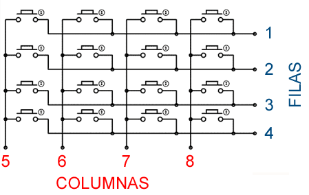

# RESUMEN DE LA PRÁCTICA

El objetivo de esta práctica es desarrollar un sistema embebido capaz de leer e interpretar las pulsaciones de un teclado matricial 4x4 y mostrar el carácter correspondiente en un display de 7 segmentos. La lógica de control se implementará en un microcontrolador PSoC, reutilizando una librería previamente desarrollada para el manejo del display.

# FUNDAMENTO TÉCNICO DEL TECLADO MATRICIAL

Un teclado matricial 4x4 consiste en 16 interruptores de pulsador momentáneo organizados en una matriz de 4 filas y 4 columnas. En lugar de requerir 16 pines dedicados, esta topología reduce el requisito a solo 8 pines (4 para filas y 4 para columnas). Internamente, cada interruptor se encuentra en la intersección de una línea de fila y una de columna. En su estado de reposo, todos los interruptores están en un circuito abierto, impidiendo el flujo de corriente entre filas y columnas. Al presionar un botón, se cierra el circuito en esa intersección específica, creando una conexión eléctrica directa entre su fila y columna correspondiente.

## Estructura Interna y Eficiencia de Pines

Al observar el diagrama interno de un teclado matricial 4x4, se evidencia su eficiente diseño. Una primera aproximación podría sugerir la necesidad de 16 pines dedicados, uno para cada botón. Sin embargo, su arquitectura de matriz reduce este requisito a solo 8 pines. La pregunta fundamental es: ¿cómo se identifica qué botón específico está siendo presionado? La respuesta reside en un algoritmo de barrido y en la configuración asimétrica de sus conexiones.

## Configuración de Entradas y Salidas

Para implementar la lógica de detección, se configuran 4 pines del microcontrolador como salidas (conectados a las filas) y los otros 4 como entradas (conectados a las columnas). Podemos entender esta configuración con una analogía simple: cada botón funciona como un interruptor individual. Las columnas, configuradas como entradas, actúan como los pines de lectura digital. Las filas, configuradas como salidas, funcionan como una tierra programable.

Para asegurar un estado lógico estable, las entradas de las columnas se configuran con una resistencia pull-up interna. Esto garantiza que, en estado de reposo, el microcontrolador siempre lea un 1 lógico (5V). Cuando un botón se presiona, el circuito de su columna se cierra, conectándose a su respectiva fila. Si esa fila ha sido programada con un 0 lógico, la columna es arrastrada a tierra, provocando un cambio de estado detectable.

## Generación de Constantes mediante Barrido

Este principio es la clave para la identificación. El algoritmo de barrido activa una sola fila a la vez poniéndola en 0. Al detectar un cambio de estado en una columna, el sistema sabe inequívocamente qué interruptor fue cerrado basándose en qué fila estaba activa en ese preciso instante. La combinación del estado de la fila activa y la columna que cambió de estado nos permite generar una constante hexadecimal única para cada uno de los 16 botones, la cual sirve como su identificador en el software.

